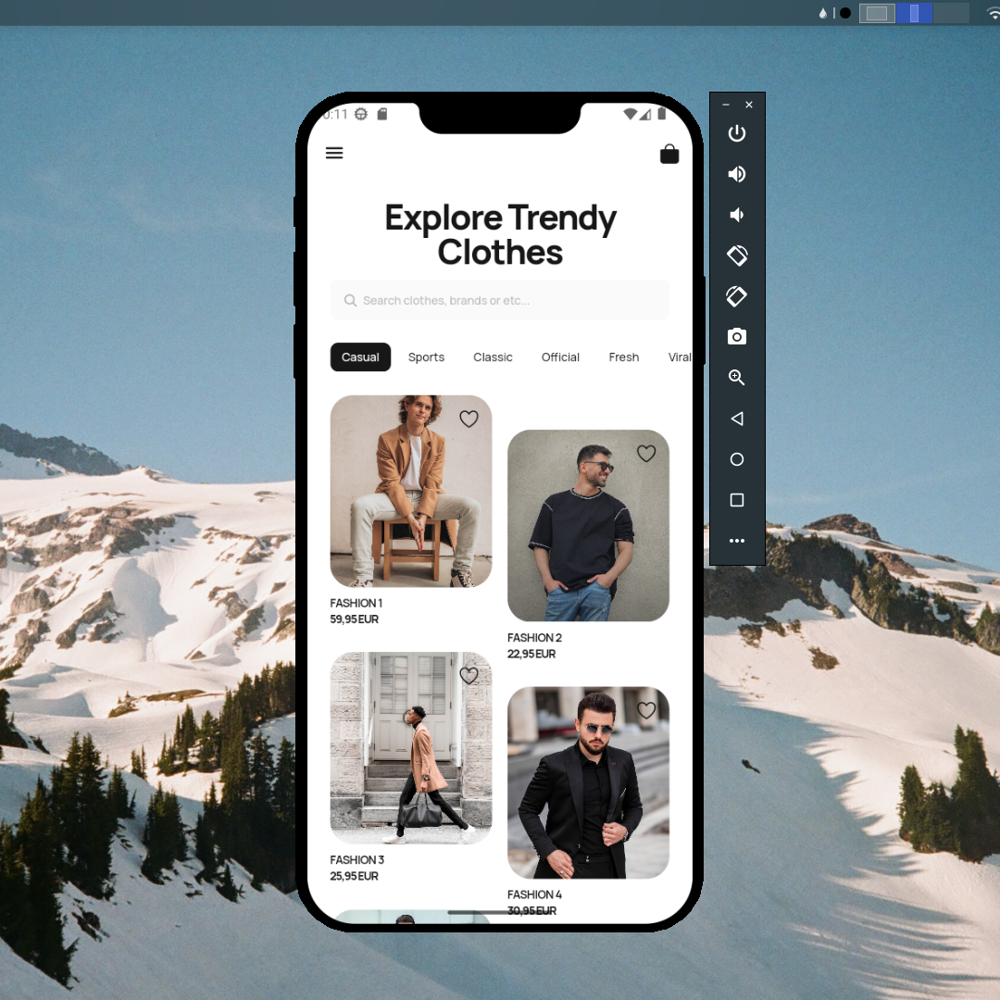

## Flutter UI - Fashion ECommerce

```dart
void main() => runApp(MaterialApp(
      theme: ThemeData(fontFamily: 'Manrope'),
      debugShowCheckedModeBanner: false,
      home: HomeScreen(),
    ));
```

## Development Setup
```
git clone https://github.com/afifudinx/flutter-fashion-ecommerce.git
cd flutter-fashion-ecommerce
flutter pub get
flutter run
```

## Screenshots


## Links

* [Website](https://afifudinx.vercel.app)
* [Youtube channel](https://youtube.com/developedbyafif)
* [Instagram](https://instagram.com/developedbyafif)
