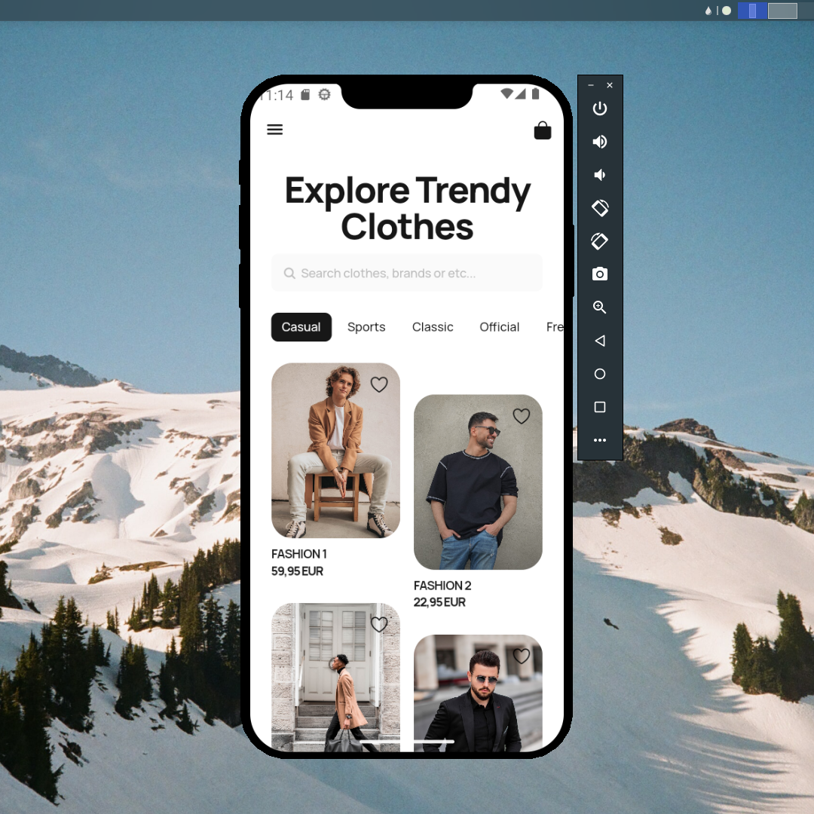

## Flutter UI - Fashion ECommerce

```dart
void main() => runApp(MaterialApp(
      theme: ThemeData(fontFamily: 'Manrope'),
      debugShowCheckedModeBanner: false,
      initialRoute: '/',
      onGenerateRoute: (settings) {
        final arguments = settings.arguments;
        if (settings.name == '/detail') {
          DetailScreenArguments args = arguments as DetailScreenArguments;
          return RouteAnimation.slide(
              settings,
              DetailScreen(
                  name: args.name,
                  price: args.price,
                  is_liked: args.is_liked,
                  image_url: args.image_url));
        } else {
          return RouteAnimation.slide(settings, const HomeScreen());
        }
      },
    ));
```

Dribbble 
* [Fashion Ecommerce Application by Sara Sayyad on Dribbble](https://dribbble.com/shots/20257137-Fashion-Ecommerce-Application)

## Development Setup
```
git clone https://github.com/afifcodes/flutter-fashion-ecommerce.git
cd flutter-fashion-ecommerce
flutter pub get
flutter run
```

## Screenshots



## Links

* [Website](https://afifcodes.vercel.app)
* [Youtube channel](https://youtube.com/afifcodes)
* [Instagram](https://instagram.com/afifcodes)
